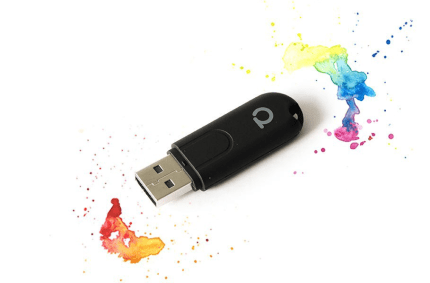

# **Home assistant**

Open source home automation that puts local control and privacy first. Powered by a worldwide community of tinkerers and DIY enthusiasts. Perfect to run on a Raspberry Pi or a local server.

## Vision

The home automation should help and simplify daily routines, provide important information relevant for daily life. It should be easily extensible and accessible to all family members. The focus is on local control instead of cloud based solution.  

## Climate Control

The climate control was the first reason to start with home automation at all. To tackle the humidity problem in our apartment, I build a simple solution based on MQTT and Python script running on Raspberry Pi Zero W. This node was gathering data from temperature and humidity sensor DHT22 and carbon dioxide (co2) from MH-Z19 sensor. I risked that and bought it from China. It is pretty sufficient for ventilation control (not speaking about absolute accuracy, since it is not so important).

Since that time, I only integrated it as part of HA using MQTT sensor integration. In future it would be great to find a better looking and more professional solution.

| Shelly1 | CO2 Sensor MH-Z19 | DHT22 Sensor | MQTT |  
| --- | --- | --- | --- |
|  | </a> | </a> |  |

## Safety first

After our old smoke detector had few false alarms, it was replaced by a smart solution - Fibaro smoke detector. It is connected over z-wave communication protocol (currently the only device). The only fear I have is that the system is not well tested, z-wave is not very user friendly for debugging (unlike zigbee with deconz events).

To minimize problems of water leaks, there is AQUARA water detector behind wash machine. Of course doesn't prevent damage, but at least inform us over notification service with highest priority. Important if we are on shopping or somewhere nearby. There is a plan to combine it with automatic closing of valves, but so far I didn't find a fitting solution. Sensor uses a Zigbee connection.

| Fibaro smoke detector | AQUARA water detector | z-wave |  
| --- | --- | --- |
|  | </a> |  |

## Hardware and connectivity

Home Assistant runs on Raspberry Pi, which is nice, versatile and low power device.
Zigbee devices are connected to Conbee II Zigbee gateway and Z-Wave devices to Aeotec Z-Stick gen5 - both are USB sticks.
There is also MQTT server running.

| Raspberry Pi 3B | Conbee-II | Aeotec Z-Stick gen5 | Raspberry Pi Zero W |  
| --- | --- | --- | --- |
|  | </a> | </a> |  |

## Software

Home Assistant Core runs in Docker container installed on Raspbian. Z-Stick must be provided to docker contained as a device. 
A simple bash script is used to do all steps to update docker image automaticaly (it takes some time on RPI):

```sh
docker stop home-assistant
docker rm home-assistant
docker pull homeassistant/raspberrypi3-homeassistant:stable
docker run -d --net=host --device=/dev/serial/by-id/usb-0658_0200-if00 --name home-assistant -v /home/pi/homeassistant:/config --restart=always homeassistant/raspberrypi3-homeassistant:stable
docker start home-assistant
```

| Home Assistant | Docker | Git |
| --- | --- | --- |
|  | </a> | --- |
